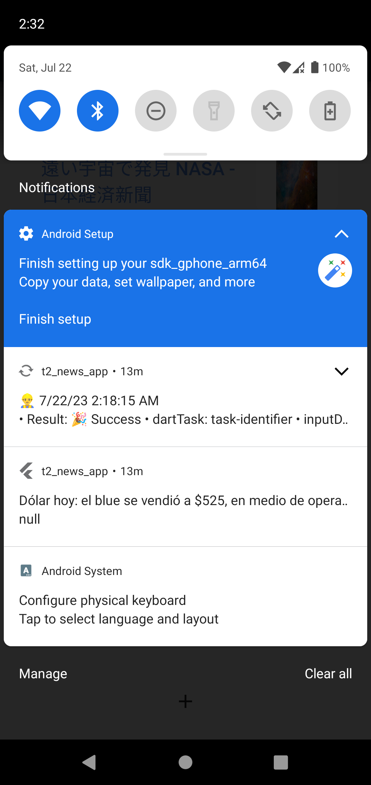

# تطبيق الأخبار (أيفون و أندرويد)

## الوصف:

- تطبيق تم إنشاؤه يعمل بنظام الأندرويد والأيفون.
- هو تطبيق يقوم بعرض الأخبار على حسب الدولة ونوع الخبر.
- يعرض أيضًا اشعار كل ساعة بآخر خبر.
- الأخبار من موقع : https://newsapi.org/

## صور التطبيق:

# News App (iOS & android)

## Description:

- A Flutter project.
- It is created for iOS & android.
- It is an application that displays news by country and type of news.
- It also displays an hourly notification of the latest news.
- News API from the site: https://newsapi.org/

## Application images:

